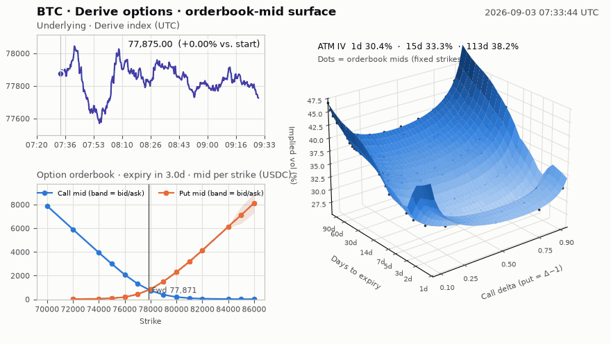
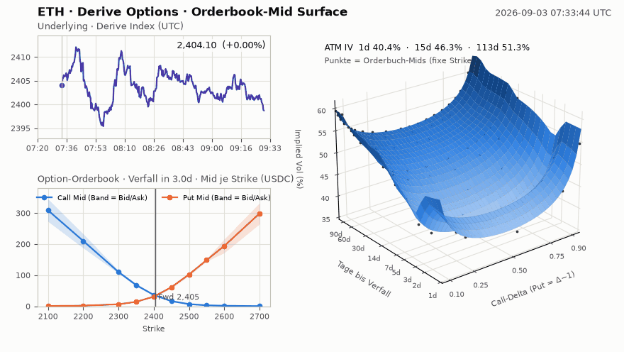
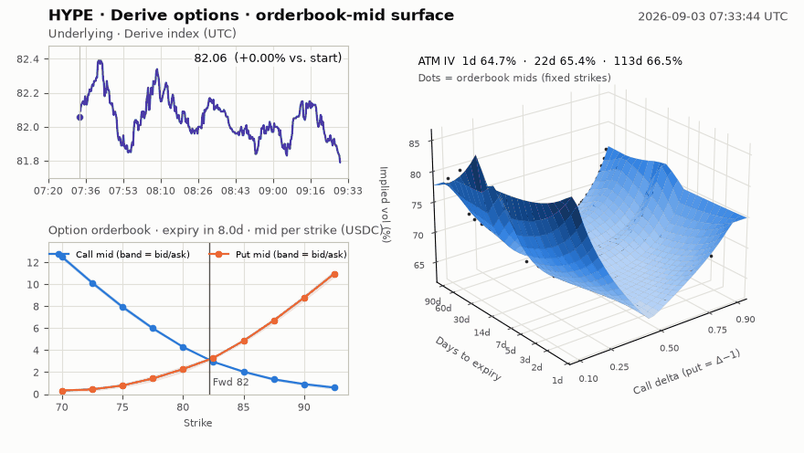
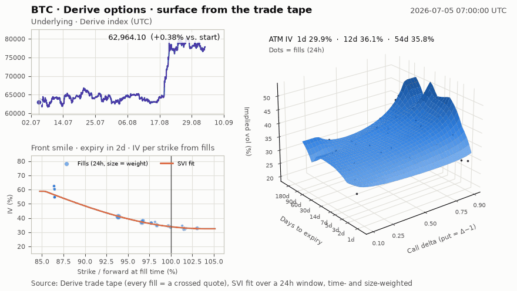
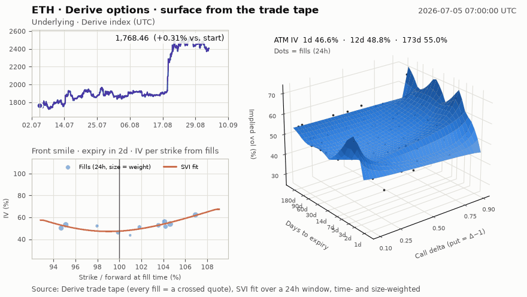
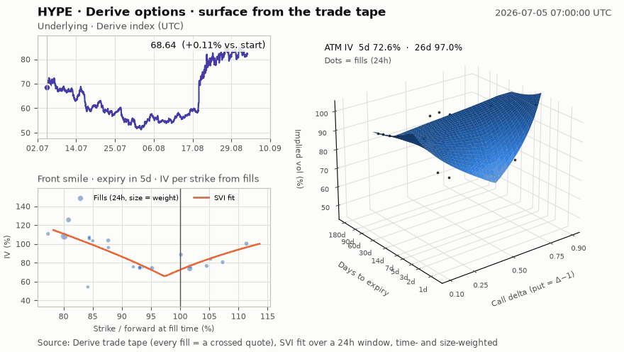
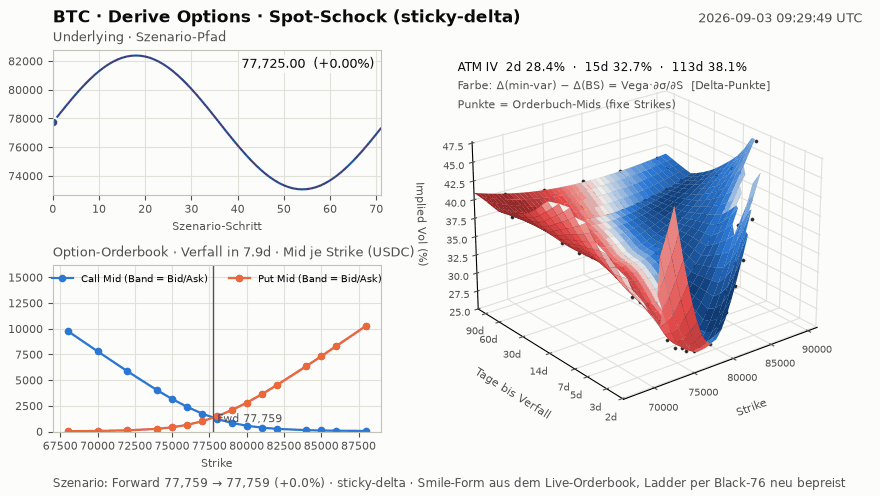
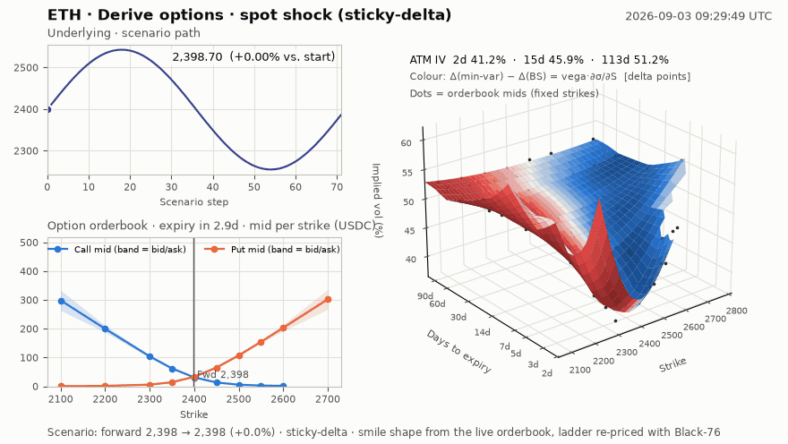
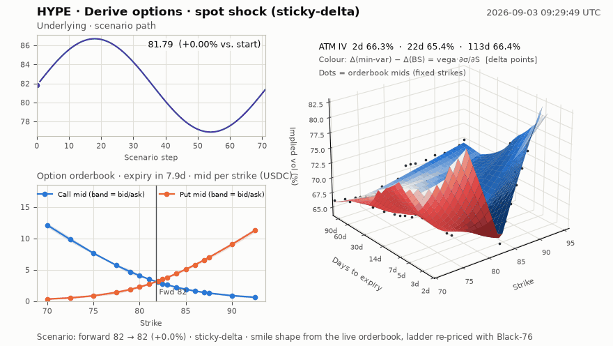

# Derive Option Surface

Implied-Volatility-Surfaces für **BTC, ETH und HYPE** aus dem Options-Orderbuch von [Derive](https://derive.xyz)
— als 3D-Koordinatensystem *(Delta, Laufzeit, IV)*, das sich bewegt, wenn sich das Underlying bewegt.

Drei Blickwinkel, jeweils als GIF (und MP4 in `docs/media/`):

| | Was die Animation zeigt | Datenquelle |
|---|---|---|
| **Live** | Orderbuch-Mids und Surface in Echtzeit, aufgezeichnet über {{LIVE_DURATION}} | Top-of-Book jeder lebenden Option alle 20 s (`get_tickers`) |
| **Tape** | Wie die Surface über die letzten 60 Tage gewandert ist (inkl. BTC +23 % im August) | Jeder Fill des Trade-Tapes (= gekreuzte Quote) + Spot-Feed |
| **Schock** | Mechanik isoliert: Spot ±6 %, Smile-Form eingefroren, Ladder neu bepreist | Letzter Live-Snapshot, Black-76 |

---

## 1 · Live: Orderbuch-Mid → Surface

Links oben der Derive-Index, links unten das Options-Orderbuch des Front-Verfalls (Mid je Strike, Band = Bid/Ask),
rechts die Surface aus **allen** Optionen des Zeitpunkts. Wenn der Index steigt, wandert die Ladder nach rechts
(Calls teurer, Puts billiger) und die Surface reagiert dort, wo Skew und Term-Struktur es vorgeben.







## 2 · Tape: 60 Tage Surface-Historie aus dem Trade-Tape

Derive speichert **keine** historischen Orderbuch-Snapshots (siehe [Datenlage](#4--datenlage-bei-derive)).
Aber jeder Fill ist ein Punkt, an dem das Orderbuch nachweislich *war*. Aus dem kompletten Trade-Tape
({{TRADES_TOTAL}} Fills seit Januar 2024) rekonstruieren wir alle 12 h die Surface: Black-76-Inversion jedes Fills,
zeit- und größengewichteter SVI-Fit über ein 24-h-Fenster. Links unten: die Fills hinter dem Front-Smile.







## 3 · Schock: was passiert mit Ladder und Surface, wenn *nur* der Spot sich bewegt

Der Forward läuft ±6 % durch, die Smile-Form bleibt (Regime *sticky-delta*, das Standardverhalten im Krypto-Markt),
jede Option der Ladder wird mit Black-76 neu bepreist. Die Surface ist hier in **Strike-Koordinaten** gezeichnet,
damit man sie *gleiten* sieht — in Delta-Koordinaten wäre sie unter sticky-delta per Konstruktion unbewegt.
Die Farbe ist **Vanna** (∂Delta/∂Vol = ∂Vega/∂Spot): blau die Put-Seite, rot die Call-Seite — genau die Greek,
die beschreibt, wie der Skew die Delta-Hedges umschichtet, wenn der Spot läuft.







---

## 4 · Datenlage bei Derive

Alles über die öffentliche JSON-RPC/WebSocket-API (`api.lyra.finance`, ohne Wallet). Details und Befunde je Endpoint
in [`docs/derive_api_notes.md`](docs/derive_api_notes.md).

| Datensatz | Umfang | Datei |
|---|---|---|
| **Trade-Tape** BTC-Optionen | {{BTC_TRADES}} Fills, {{BTC_FROM}} → {{DATE}} | `data/trades/BTC_option_trades.parquet` |
| **Trade-Tape** ETH-Optionen | {{ETH_TRADES}} Fills, {{ETH_FROM}} → {{DATE}} | `data/trades/ETH_option_trades.parquet` |
| **Trade-Tape** HYPE-Optionen | {{HYPE_TRADES}} Fills, {{HYPE_FROM}} → {{DATE}} | `data/trades/HYPE_option_trades.parquet` |
| **Spot-Feed** je Währung | 1 min (24 h), 5 min (7 d), 15 min (30 d), 1 h (90 d) — mehr hält Derive nicht vor | `data/spot/*.parquet` |
| **Live-Orderbuch, Top-of-Book** | alle lebenden Optionen ({{LIVE_INSTR}} Instrumente), alle 20 s über {{LIVE_DURATION}}: Bid/Ask/Mengen/Mark/IV/Greeks/Index/Forward | `data/live/<CCY>_tickers.parquet` |
| **Live-Orderbuch, Tiefe** | Preis-Level (10 je Seite) der {{DEPTH_INSTR}} Optionen nahe am Geld, alle 10 s | `data/live/depth.parquet` |
| **Aktuelle Orders, komplett** | Preis-Level (20 je Seite) **jeder** lebenden Option zum Zeitpunkt {{DEPTH_SNAPSHOT_TS}} | `data/live/depth_snapshot.parquet` |

Jeder Fill trägt `trade_price`, `mark_price` und `index_price` zum Zeitpunkt des Fills; Maker- und Taker-Zeile
sind auf die Taker-Zeile dedupliziert (`direction` = Aggressor-Seite).

## 5 · Das Surface: warum (Delta, Laufzeit, IV)

Die drei Koordinaten sind die zwei, die eine Option identifizieren, und die eine Zahl, mit der das ganze Orderbuch
sie bepreist:

* **x · Call-Delta** (0,05 … 0,95; Put-Delta = Δ − 1). Delta statt Strike, weil nur so 1-Tages- und 6-Monats-Optionen
  auf derselben Achse vergleichbar sind und weil der Markt Vol in Delta-Termen quotiert (25Δ-Risk-Reversal, 25Δ-Butterfly).
  Ein Strike, der heute 25Δ ist, ist nach 5 % Spot-Bewegung 40Δ — in Delta-Koordinaten bleibt die Surface stehen, in
  Strike-Koordinaten gleitet sie (Abschnitt 3).
* **y · Laufzeit** in Tagen, logarithmisch (1 d bis ~6 Monate).
* **z · Implied Volatility** aus dem **Orderbuch-Mid**, nicht aus der Mark der Börse. Mid ist der Preis, auf den sich
  Bid und Ask gerade einigen; die Mark ist ein Modell der Börse.

Pipeline je Zeitstempel (`derive_surface/surface.py`):

1. Top-of-Book aller Optionen → Mid; nur zweiseitige Bücher, relative Spanne ≤ 80 %.
2. Nur die **OTM-Seite** jedes Strikes (Calls über, Puts unter dem Forward) — dort liegt die Liquidität, und Put-Call-Parität
   macht die ITM-Seite redundant.
3. **Black-76 auf dem Forward** (Derive liefert Forward und Diskontfaktor je Verfall), Bisektion für IV von Mid, Bid und Ask.
   Unsere Bid-/Ask-IVs treffen Derives eigene `bid_iv`/`ask_iv` auf < 1 · 10⁻⁴.
4. Gewicht je Quote = 1 / (Ask-IV − Bid-IV): enge Bücher zählen, weite Bücher stören nicht.
5. Je Verfall ein **raw-SVI**-Fit der Total-Variance w(k) = a + b·(ρ(k−m) + √((k−m)² + σ²)) (robuste Least-Squares,
   Positivitäts- und Butterfly-Check, Fallback quadratisch/flach bei dünnen Büchern wie bei HYPE).
   Jenseits der letzten Quote wird der Smile **flach gehalten** — wir erfinden keine Flügel.
6. Zwischen den Verfällen linear in Total-Variance interpoliert, auf der Delta-Achse per Fixpunkt Strike ↔ Delta.

## 6 · Welche Greeks? Erste, zweite oder dritte Ordnung?

Kurz: **Delta als Koordinate, Vanna (und Gamma/Volga) als Farbe, dritte Ordnung nur als Zahl im Modell — nicht aus dem Orderbuch.**

**Erste Ordnung (Delta, Vega, Theta, Rho)** beschreibt, wie sich der *Preis einer Option* ändert, nicht, wie sich die
*Surface* bewegt. Delta ist trotzdem die wichtigste Größe hier — als **Achse**. Vega sagt nur, wie stark eine
IV-Änderung durchschlägt; woher die IV-Änderung kommt, sagt es nicht.

**Zweite Ordnung** ist die Antwort auf die eigentliche Frage („wie bewegt sich die Surface, wenn der Spot läuft?"):

| Greek | Bedeutung | Was man in den Animationen sieht |
|---|---|---|
| **Vanna** ∂Δ/∂σ = ∂Vega/∂S | Skew × Spot-Bewegung: die Put-Seite verliert Vega, wenn der Spot steigt, die Call-Seite gewinnt | Farbverlauf blau → rot quer über die Surface; die Ladder-Puts werden schneller billiger, als Delta allein erklärt |
| **Gamma** ∂Δ/∂S | Konvexität der Ladder um den Forward | Der „Knick" der Mid-Kurven am Forward; kurze Laufzeiten reagieren am heftigsten |
| **Volga** ∂Vega/∂σ | Konvexität in Vol: die Flügel gewinnen überproportional, wenn Vol steigt | Flügel heben sich stärker als das Zentrum bei Vol-Schüben (Tape-GIF, August) |
| Charm ∂Δ/∂t | Delta-Drift über die Zeit | Front-Verfälle „wandern" von Frame zu Frame |

**Dritte Ordnung (Speed, Zomma, Color, Ultima)** ist implementiert (`pricing.greeks`) und auf jedem Gitterpunkt
abrufbar (`Surface.greeks_grid`), aber für ein DEX-Orderbuch nicht belastbar: Bid/Ask liegen typischerweise
{{SPREAD_VOLPTS}} Vol-Punkte auseinander, und jede Ableitungsordnung verstärkt dieses Rauschen. Gemessen am
BTC-Snapshot ({{SNAP_TS}}), Greeks einmal aus der Bid-IV- und einmal aus der Ask-IV-Surface gerechnet:

| Ordnung | Greek | mediane relative Abweichung Bid- vs. Ask-Surface |
|---|---|---|
| 1 | Delta / Vega | {{REL_DELTA}} / {{REL_VEGA}} |
| 2 | Gamma / Vanna / Volga | {{REL_GAMMA}} / {{REL_VANNA}} / {{REL_VOLGA}} |
| 3 | Speed / Zomma / Ultima | {{REL_SPEED}} / {{REL_ZOMMA}} / {{REL_ULTIMA}} |

Zweite Ordnung ist noch Signal, dritte Ordnung ist überwiegend Spread. Wer Speed oder Zomma braucht, rechnet sie aus
der **geglätteten** Surface (SVI), nicht aus einzelnen Quotes — genau das tut `greeks_grid`.

Alle Färbungen sind wählbar: `python -m derive_surface animate live BTC --color-by gamma` (oder `vanna`, `volga`,
`charm`, `speed`, `zomma`, `color`, `ultima`).

## 7 · Reproduzieren

```bash
pip install -r requirements.txt
python -m pytest -q                                   # 17 Tests: Put-Call-Parität, IV-Roundtrip, alle Greeks vs. finite Differenzen, SVI-Recovery

python -m derive_surface download BTC ETH HYPE        # komplettes Trade-Tape + Spot-Historie  (~10 min)
python -m derive_surface record tickers --duration 7200 &   # Top-of-Book alle 20 s
python -m derive_surface record depth   --duration 7200 &   # Preis-Level nahe am Geld
python -m derive_surface depth-snapshot               # alle Orders aller Optionen, jetzt
python -m derive_surface merge

python -m derive_surface animate live  BTC            # docs/media/BTC_live.gif + .mp4
python -m derive_surface animate tape  ETH --days 60
python -m derive_surface animate shock HYPE --regime sticky_strike --color-by gamma
```

Alle Aufrufe brauchen nur die öffentliche API — kein Wallet, kein Key.

## 8 · Repository

```
derive_surface/
  api.py        JSON-RPC/WebSocket-Client (Retry, Slim-Ticker-Parser, Instrumentnamen)
  history.py    Trade-Tape (paginiert, resumable) + Spot-Feed → parquet
  recorder.py   Live-Recorder: Top-of-Book je Verfall, WebSocket-Tiefe, kompletter Depth-Snapshot
  pricing.py    Black-76, IV-Inversion (Bisektion), Greeks 1.–3. Ordnung
  surface.py    Quotes → SVI-Smiles → Gitter (Delta / log-Moneyness / Strike), Greeks auf dem Gitter
  tape.py       Surfaces aus dem Trade-Tape (zeit-/größengewichtet)
  animate.py    Frames (Index · Ladder/Smile · 3D-Surface) → GIF/MP4
  shock.py      Spot-Schock-Szenario (sticky-delta / sticky-strike)
tests/          Pricing- und Surface-Tests
data/           Trade-Tape, Spot, Live-Aufzeichnung, Depth-Snapshot (parquet)
docs/           API-Befunde, Medien
```

## 9 · Grenzen

* Historische Orderbuch-Zustände existieren bei Derive nicht; das Tape ist die dichteste öffentliche Spur. Bei HYPE ist es
  an ruhigen Tagen dünn — dann fällt der Fit auf quadratisch/flach zurück oder der Verfall entfällt.
* Forward ≈ Index im Tape (Derives Basis liegt bei wenigen Basispunkten); live wird der echte Forward benutzt.
* Die Live-Aufzeichnung deckt {{LIVE_DURATION}} ab. Der Recorder läuft beliebig lang: `record tickers --duration 86400`.
